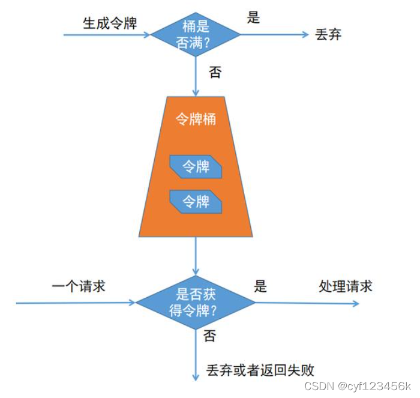
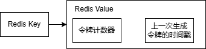
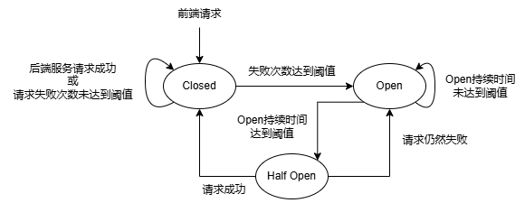
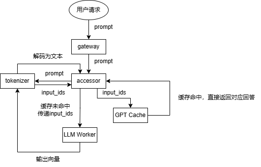
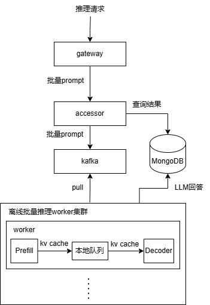
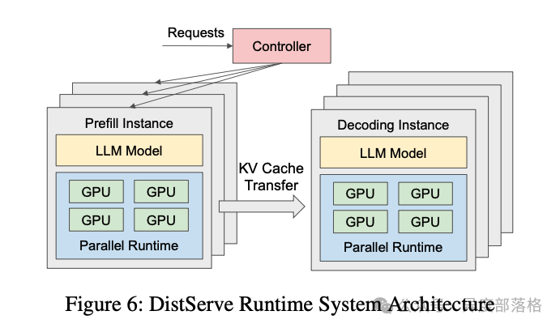

# llm_inference_web
大模型推理web：大模型网关层 + 在线推理链路 + 离线批量推理链路

## 整体架构

1. **在线推理链路**：用户需要实时流式响应；链路重点关注低时延，因此未引入消息队列组件；使用网关层能力来保证服务在高峰期可用。
2. **离线批量推理链路**：用户无需实时响应，但一次请求需要推理尽可能多的prompt；链路重点关注高吞吐，因此引入消息队列、PD分离来增加系统吞吐量。

## 网关层（Gateway）
### 1. 令牌桶限流

#### 原理
- 以固定速率生成令牌到桶内，若桶内有足够令牌则丢弃当前生成的令牌；
- 请求到来后，先从令牌桶取出一个令牌；若未取到则拒绝处理请求。  
#### 实现
- 使用Redis Lua脚本实现，无需在网关进程维护定时任务，减轻网关进程的压力
- Redis存储结构  

- 当请求到来时，先计算本次需新增的令牌数 = (当前时间 - 上次生成令牌时间) * 令牌生成速率
- 检查桶内是否有足够的令牌，若无则拒绝请求，若有则更新Redis令牌计数器。
### 2. 服务降级熔断
- **服务降级**：**系统整体负载剧增**时，对一些后端服务故意的不请求，直接返回HTTP Too Many Requests；
- **服务熔断**：**链路上某些服务长时间不可用**时，不调用该后端服务，直接返回错误信息给用户。
- **实现**：基于FSM实现的断路器模式（Circuit Breaker）

- 考虑到网关是多实例部署，FSM状态应统一维护在Redis内，多个网管实例共同读写该状态，并使用分布式锁保护状态。

## 在线推理链路：重点关注低时延
**在线推理用户需要实时流式响应**，对于单论对话一次请求，**推理数据的batch_size = 1**。  

### 主要流程
1. accessor将输入prompt传递给tokenizer服务，获取分词向量化后的LLM输入向量（input_ids），同时打开SSE流；
2. accessor根据input_ids查询GPT Cache（语义缓存）；
3. 若命中语义缓存，则直接向SSE推流缓存的模型回答文本；
4. 若未命中语义缓存，则向LLM推理节点传递input_ids和chat_session_id（标识一次会话，让LLM在推理过程中专注于当前会话的上下文），LLM推理节点**流式输出**模型回答向量到accessor；
5. accessor请求tokenizer将模型回答向量解码为文本，向SSE推流回答文本，并**更新语义缓存**。
### 降低响应时延的方法
- 使用GPT Cache语义缓存，减少LLM推理次数；
- LLM内部使用KV Cache，减少单论对话内KV矩阵重复计算次数。
### 主要模块
- accessor服务：大模型推理Web接入层，管理推理主流程与用户历史问答；
- tokenizer服务：无状态，仅对当前输入的prompt进行分词向量化；
- **GPT Cache：语义缓存**  
> - 使用**向量数据库**构建 prompt向量-模型回答文本 的语义缓存，可以根据向量的相似性（比如向量的余弦相似度）进行检索。
> - **适用场景**：针对**无需太多创造性的场景**。比如一个物理知识问答LLM，物理定律总是一成不变的，所以多次相同问题返回相同回答是可以的。
- **LLM Worker**：根据chat_session_id区别不同对话的上下文，输入当前prompt的分词向量input_ids，利用滑动窗口结合历史上文（比如滑动窗口大小为4096，上文token数为6000，那么只取[-4096:]的上文tokens）进行推理，并输出模型回答向量

## 离线批量推理链路：重点关注高吞吐
**离线批量推理用户需要一次请求批量输入尽可能多的prompts**，对于一次请求，**推理数据的batch_size > 1**。  

### 提高吞吐量的手段
- **kafka**
> - 作用：将流程异步化，防止用户请求进来的速率与LLM处理速率不匹配（生产者 - 消费者模式），增加系统吞吐量，以及削峰填谷。
> - accessor作为请求数据的生成；LLM离线推理集群作为请求的消费者，从kafka主动pull请求数据。
- LLM离线推理集群节点**PD分离**

> - **PD分离**：P指Prefill，D指Decode
> - **Prefill阶段**：**计算密集型任务**，计算KV Cache；
> - **Decode阶段**：**存储密集型任务**，根据KV Cahe与prompt，自回归生成模型回答。
> - 作用：拆分计算密集型与存储密集型任务，提高GPU利用率，从而提高系统吞吐量。
